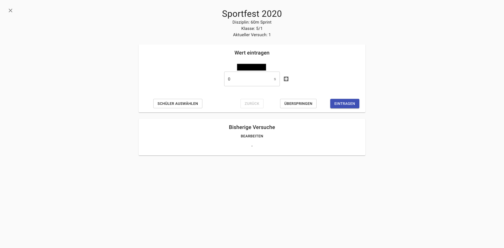
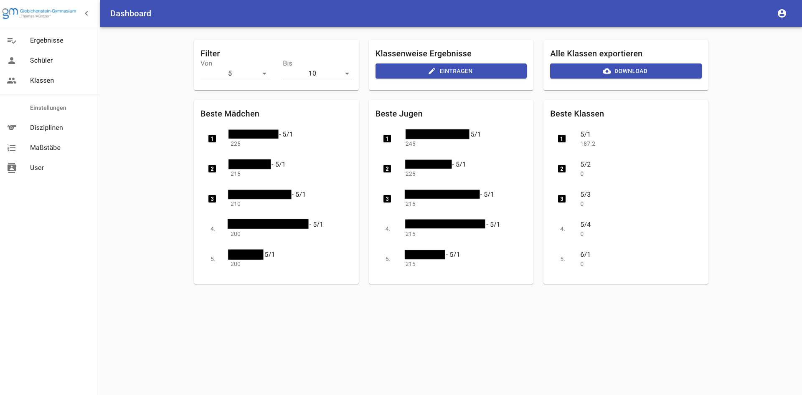
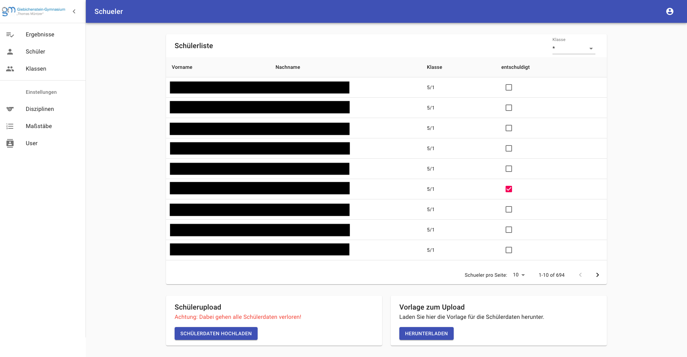
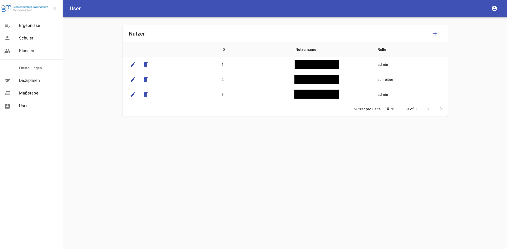

# Sportfest Frontend

Here you can find the source code of the user interface for the evaluation system of the sports festival at the Giebichenstein-Gymnasium "Thomas Müntzer".

## Screenshots
##### Interface referee

##### Results overview

##### Students overview

##### User overview

## Documentation
You can find the german documentation [here](doc/Dokumentation-v1.0.0.pdf).
